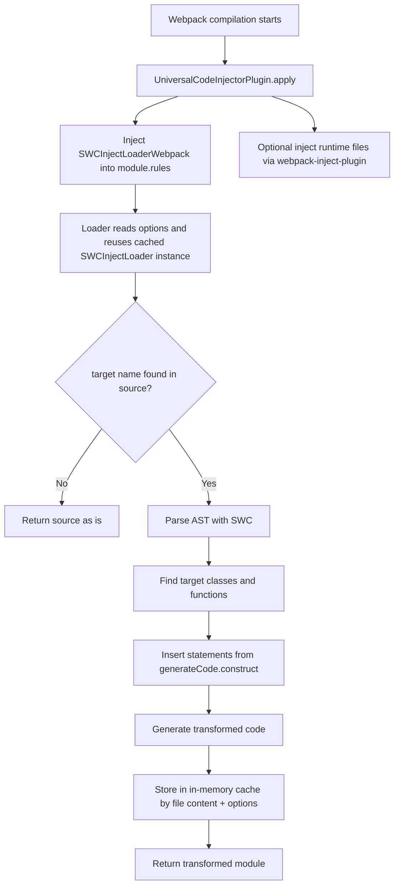

# webpack-tracer-plugin

Плагин для Webpack, который автоматически добавляет трассирующий код в целевые классы/функции во время сборки.

Основной сценарий: добавить `Tracer.observeProperty(...)` (или любой другой код) в конструкторы выбранных классов без ручного редактирования исходников.

Важно: плагин теперь явно подключает пакет `tracer` автоматически и делает это первым entry-скриптом (`ENTRY_ORDER.First`), чтобы `globalThis.Tracer` был доступен до остальных инъекций.

## Как подключить

1. Установите зависимости:

```bash
npm i -D webpack webpack-cli
npm i webpack-tracer-plugin
```

2. Подключите плагин в `webpack.config.js`:

```js
const path = require('node:path');
const { UniversalCodeInjectorPlugin } = require('webpack-tracer-plugin');

module.exports = {
  mode: 'development',
  entry: './src/index.js',
  output: {
    path: path.resolve(__dirname, 'dist'),
    filename: 'bundle.js'
  },
  plugins: [
    new UniversalCodeInjectorPlugin({
      // включает webpack cache: { type: 'filesystem' } по умолчанию
      enableCacheFilesystem: true,
      cacheDirectory: path.resolve(__dirname, '.webpack-cache'),

      injectLoaderOpts: {
        targets: ['UserService', 'OrderService'],
        fallbackOnError: false,
        debug: false,
        generateCode: {
          construct: ({ className }) => {
            return `Tracer.observeProperty(this, 'id', '${className}');`;
          }
        }
      }
    })
  ]
};
```

## Полный список настроек `UniversalCodeInjectorPlugin`

Ниже перечислены все доступные настройки плагина и вложенные параметры `injectLoaderOpts`.

### Настройки плагина (верхний уровень)

| Настройка | Тип | По умолчанию | Назначение |
| --- | --- | --- | --- |
| `enableCacheFilesystem` | `boolean` | `true` | Включает `compiler.options.cache = { type: 'filesystem' }` если в конфиге Webpack не задан `cache`. |
| `cacheDirectory` | `string` | `<compiler.context>/.webpack-cache` | Путь к каталогу кэша webpack. |
| `injectTracerRuntimeFirst` | `boolean` | `true` | Подключает runtime `tracer` в начало entry-цепочки через `webpack-inject-plugin` (`ENTRY_ORDER.First`). |
| `injectLoaderOpts` | `object` | — | Передаёт опции в `SWCInjectLoader` и включает трансформацию файлов через `/\.js$/` правило. Если не задано, плагин только подключает runtime. |
| `listInjectPluginOptions` | `Array<{ options, files }>` | `undefined` | Дополнительные инъекции через `webpack-inject-plugin`: для каждого элемента `files` объединяются и вставляются с параметрами `options`. |
| `logWatchTimings` | `boolean` | `true` | Логирует сводку пересборки (`files`, `transformed`, время), когда включён watch. |

### `injectLoaderOpts`

| Настройка | Тип | По умолчанию | Назначение |
| --- | --- | --- | --- |
| `targets` | `Set<string> | Array<string> | function` | `new Set()` | Список/множество имён классов и функций или функция `({className}) => boolean`/`(targetName) => boolean` для фильтрации. |
| `generateCode` | `object` | `{ construct: () => '' }` | Набор хук-функций для вставки кода (`construct`, `afterClass`, `afterPrototypeMethod`, `afterAll`, `beforeEndIIFE`). |
| `classConfig` | `Map` | `new Map()` | Расширяемая конфигурация класса (в текущей версии почти не используется, оставлена для совместимости/расширения). |
| `trackPrototypes` | `boolean` | `true` | Флаг управления трекингом прототипов (в текущей версии напрямую не влияет на поведение). |
| `trackInheritance` | `boolean` | `true` | Флаг управления унаследованными типами (в текущей версии напрямую не влияет на поведение). |
| `insertPosition` | `'start' \| 'end'` | `'end'` | Где вставлять сгенерированный код в конструкторе/функции. |
| `fallbackOnError` | `boolean` | `false` | Если `false`, ошибки трансформации падают сборку; если `true`, возвращается исходный `source` и сборка продолжается. |
| `debug` | `boolean` | `false` | Включает диагностические логи плагина и лоадера (кроме debug-only защиты callback-ов для `targets`). |
| `allowTargetsCallbackInDebug` | `boolean` | `false` | Разрешает `targets` как функцию в `debug`-режиме; без этого callback-типа в debug игнорируется. |
| `disableProcessCache` | `boolean` | `false` | Полностью отключает процессный кеш трансформаций. |
| `disableProcessCacheInWatch` | `boolean` | `true`? | При watch-режиме принудительно включает `disableProcessCache` (если явно не `false`). |
| `disableWebpackLoaderCacheInWatch` | `boolean` | `false` | Отключает `cacheable` в лоадере во время watch (чтобы свежие пересчёты не брались из лоадер-кэша). |

### Параметры хука `generateCode`

| Хук | Аргументы | Что делает |
| --- | --- | --- |
| `construct` | `{ className, hasInstanceMethodsOnThis }` | Код, который вставляется в конструктор класса/функции. |
| `afterClass` | `{ className }` | Код после декларации класса (`ClassDeclaration`) целевой сущности. |
| `afterPrototypeMethod` | `{ className, methodName }` | Код после последнего найденного прототипного метода класса. |
| `afterAll` | `{ filePath, moduleSymbols, hasIIFE }` | Код в конце модуля, если в файле нет top-level IIFE. |
| `beforeEndIIFE` | `{ filePath, moduleSymbols, hasIIFE }` | Код перед закрытием top-level IIFE, если IIFE есть. |

## Как использовать на примерах

### Пример 1. Вставка `Tracer.observeProperty` в выбранные классы

```js
new UniversalCodeInjectorPlugin({
  // по умолчанию true: подключает tracer первым скриптом
  injectTracerRuntimeFirst: true,
  injectLoaderOpts: {
    targets: ['UserService', 'PaymentService'],
    generateCode: {
      construct: ({ className }) => {
        return [
          `Tracer.observeProperty(this, 'state', '${className}');`,
          `Tracer.observeProperty(this, 'status', '${className}');`
        ].join('\n');
      }
    }
  }
});
```

Если в проекте нужен полностью ручной контроль подключения runtime, можно отключить авто-инъекцию:

```js
new UniversalCodeInjectorPlugin({
  injectTracerRuntimeFirst: false,
  injectLoaderOpts: { ... }
});
```

### `generateCode` и доступные хуки

В `injectLoaderOpts.generateCode` можно передать до пяти хуков. Каждый хук получает объект с параметрами и может вернуть строку, которая будет вставлена в итоговый код.

```js
new UniversalCodeInjectorPlugin({
  injectLoaderOpts: {
    generateCode: {
      construct: ({ className, hasInstanceMethodsOnThis }) => `Tracer.observeProperty(this, 'id', '${className}');`,
      afterClass: ({ className }) => `globalThis.__afterClass('${className}');`,
      afterPrototypeMethod: ({ className, methodName }) => `globalThis.__afterPrototype('${className}', '${methodName}');`,
      afterAll: ({ filePath, moduleSymbols, hasIIFE }) =>
        `globalThis.__afterAll('${filePath}', ${hasIIFE}, ${JSON.stringify(moduleSymbols.classes)});`,
      beforeEndIIFE: ({ filePath, moduleSymbols, hasIIFE }) =>
        `globalThis.__beforeEndIIFE('${filePath}', ${hasIIFE}, ${JSON.stringify(moduleSymbols.functions)});`
    }
  }
});
```

Таблица параметров и места вставки:

| Хук | Параметры | Куда вставляется код |
| --- | --- | --- |
| `construct` | `className`<br/>`hasInstanceMethodsOnThis` | В тело конструктора целевого класса или в тело целевой функции. Если класс без конструктора, создаётся конструктор и туда вставляется код. Для классов вставка идёт в начало/конец конструктора по `insertPosition` (`start`/`end`). |
| `afterClass` | `className` | Как отдельное statement в контейнере AST сразу после `ClassDeclaration` целевого класса. |
| `afterPrototypeMethod` | `className`, `methodName` | После последнего найденного присваивания прототипного метода целевого класса (`C.prototype.m = ...`, скобочные и object-style варианты), в тот же контейнер после этой инструкции. |
| `afterAll` | `filePath`, `moduleSymbols`, `hasIIFE` | В модульный уровень: добавляется в конец `ast.body`, когда top-level IIFE отсутствует. `moduleSymbols` содержит списки найденных в модуле символов верхнего уровня (`constructors`, `classes`, `functions`), `hasIIFE = false`. |
| `beforeEndIIFE` | `filePath`, `moduleSymbols`, `hasIIFE` | В тело top-level IIFE, перед его закрытием (`findBeforeEndIndex`). `moduleSymbols` собираются из верхнего уровня этой IIFE, `hasIIFE = true`. |

Примечание по `construct`: параметр `hasInstanceMethodsOnThis` равен `true`, если в верхнем уровне конструктора/функции есть присваивание вида `this.<prop> = ...`.

Краткое итоговое правило:

- `afterAll` выполняется в конце JS-модуля (вставка в конец `ast.body`) и только когда top-level IIFE отсутствует.
- `beforeEndIIFE` выполняется только при наличии top-level IIFE и вставляется в конец IIFE перед `})();` (в таком файле `afterAll` для того же вызова не добавляется).
- `afterPrototypeMethod` выполняется после последнего найденного определения метода на прототипе целевого класса.
- `afterClass` выполняется для каждого ES6 `class`-объявления целевого класса.

## Формат `moduleSymbols`

`moduleSymbols` — это объект со списками имён, найденных на верхнем уровне анализируемого блока:

```js
{
  constructors: string[],
  classes: string[],
  functions: string[],
}
```

Как формируется:

- Для `afterAll` (`hasIIFE: false`) список собирается по `ast.body` модуля.
- Для `beforeEndIIFE` (`hasIIFE: true`) список собирается по телу top-level IIFE.

Что туда попадает:

- `constructors`: имена классов и/или функций, которые рассматриваются как конструкторы целевых сущностей.
- `classes`: имена `class`-объявлений на верхнем уровне блока.
- `functions`: имена function-объявлений на верхнем уровне блока.

Важно: это только верхний уровень анализируемого контейнера (без глубокого сканирования вложенных блоков и вложенных функций).

### Пример 2. Подключение runtime-файла трассера в бандл

```js
const path = require('node:path');
const { ENTRY_ORDER } = require('webpack-inject-plugin');

new UniversalCodeInjectorPlugin({
  injectLoaderOpts: {
    targets: ['UserService'],
    generateCode: {
      construct: ({ className }) => `Tracer.observeProperty(this, 'id', '${className}');`
    }
  },
  listInjectPluginOptions: [
    {
      options: {
        entryName: (name) => name === 'main',
        entryOrder: ENTRY_ORDER.First
      },
      files: [path.resolve(__dirname, './src/tracer-runtime.js')]
    }
  ]
});
```

## Описание принципа через пример

Исходный код:

```js
class UserService {
  constructor() {
    this.id = 10;
  }
}
```

`generateCode.construct`:

```js
({ className }) => `Tracer.observeProperty(this, 'id', '${className}');`
```

Результат после трансформации:

```js
class UserService {
  constructor() {
    Tracer.observeProperty(this, 'id', 'UserService');
    this.id = 10;
  }
}
```

## Что означает автогенерированный блок фасада Tracer

Плагин добавляет небольшой сгенерированный блок, похожий на этот:

```js
(() => {
  const g = typeof globalThis !== "undefined" ? globalThis : (typeof window !== "undefined" ? window : undefined);
  if (!g) return;
  if (g.Tracer && g.Tracer.__isTracerFacade !== true) {
    return;
  }
  const pendingKey = "__WEBPACK_TRACER_PENDING_CALLS__";
  g[pendingKey] = Array.isArray(g[pendingKey]) ? g[pendingKey] : [];
  if (g.Tracer && g.Tracer.__isTracerFacade === true) {
    return;
  }
  const facade = new Proxy({ __isTracerFacade: true }, {
    get(target, prop) {
      if (prop === "__isTracerFacade") return true;
      return function(...args) {
        const runtime = g.__WEBPACK_TRACER_RUNTIME_INSTANCE__;
        const tracer = runtime && runtime.__isTracerFacade !== true ? runtime : null;
        if (tracer && typeof tracer[prop] === "function") {
          return tracer[prop](...args);
        }
        g[pendingKey].push([prop, args]);
        return undefined;
      };
    }
  });
  g.Tracer = facade;
  if (typeof window !== "undefined") {
    window.Tracer = facade;
  }
})();
```

Где это берётся из кода:
- Этот код создаётся в `SWCInjectLoader.getTracerFacadeCode()` и вставляется перед сгенерированными хуками через `getObserverStatements`.
- По сути это защитный слой, который делает вызовы `Tracer.*` безопасными до того, как подключится runtime.

Почему он нужен:
1. `generateCode.construct` может вставлять `Tracer.observe(...)` в код, который исполняется раньше инициализации runtime.
2. Если runtime ещё не загружен, вызовы не должны ломать приложение.
3. Эти вызовы нужно не потерять, а отложить.

Как работает:
- Если `window/globalThis.Tracer` уже инициализирован не как фасад (`__isTracerFacade !== true`), блок ничего не делает.
- Если `Tracer` отсутствует или это ещё не инициализированный runtime, создаётся `Proxy`.
- Каждый вызов `Tracer.foo(...)`:
  - пробует сразу вызвать настоящий runtime (`__WEBPACK_TRACER_RUNTIME_INSTANCE__`),
  - иначе кладёт `[foo, args]` в `window.__WEBPACK_TRACER_PENDING_CALLS__`.
- Когда runtime `tracer` грузится, очередь из `__WEBPACK_TRACER_PENDING_CALLS__` может быть обработана bootstrap-кодом.

Итог: это даёт порядок «безопасно сейчас + выполнить позже», чтобы не ломать ранний код инъекций и не терять события/вызовы.

## Схема с принципом работы плагина



## Описание крайних случаев

- `targets` пустой или не задан: модуль возвращается без изменений.
- `generateCode`-хук вернул пустую строку/`undefined`: инъекция для конкретного вхождения не выполняется.
- Класс/функция не найден(а) в файле: файл проходит без изменений.
- Ошибка AST-трансформации: включается fallback на строковую трансформацию.
- Ошибка в loader:
  - `fallbackOnError: false` (по умолчанию): сборка падает с ошибкой.
  - `fallbackOnError: true`: возвращается исходный `source`, сборка продолжается.
- Плагин добавляет правило только для `/\.js$/` (не `ts/tsx` на уровне webpack rule в текущей реализации).
- Автокэш webpack filesystem включается только если в конфиге уже не задан `options.cache`.
- В большом проекте лучше указывать узкий список `targets`, иначе увеличится время обхода AST.

## Рекомендации по производительности

- Держите `targets` как можно уже.
- Оставляйте `enableCacheFilesystem: true` для dev-сборок.
- Не генерируйте очень длинные строки в `construct`.
- Используйте `listInjectPluginOptions` только для реально нужных runtime-файлов.

## Экспорт из пакета

```js
const {
  TracerCodeGenerator,
  UniversalCodeInjectorPlugin,
  SWCInjectLoader
} = require('webpack-tracer-plugin');
```
