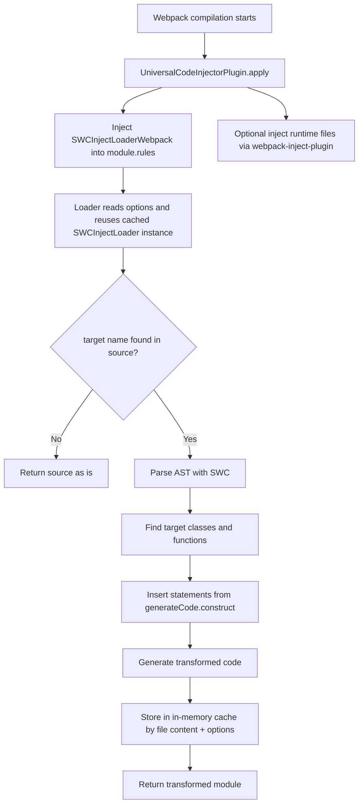

# webpack-tracer-plugin

Плагин для Webpack, который автоматически добавляет трассирующий код в целевые классы/функции во время сборки.

Основной сценарий: добавить `Tracer.observeProperty(...)` (или любой другой код) в конструкторы выбранных классов без ручного редактирования исходников.

## Как подключить

1. Установите зависимости:

```bash
npm i -D webpack webpack-cli
npm i webpack-tracer-plugin
```

2. Подключите плагин в `webpack.config.js`:

```js
const path = require('node:path');
const { UniversalCodeInjectorPlugin } = require('webpack-tracer-plugin');

module.exports = {
  mode: 'development',
  entry: './src/index.js',
  output: {
    path: path.resolve(__dirname, 'dist'),
    filename: 'bundle.js'
  },
  plugins: [
    new UniversalCodeInjectorPlugin({
      // включает webpack cache: { type: 'filesystem' } по умолчанию
      enableCacheFilesystem: true,
      cacheDirectory: path.resolve(__dirname, '.webpack-cache'),

      injectLoaderOpts: {
        targets: ['UserService', 'OrderService'],
        fallbackOnError: false,
        debug: false,
        generateCode: {
          construct: ({ className }) => {
            return `Tracer.observeProperty(this, 'id', '${className}');`;
          }
        }
      }
    })
  ]
};
```

## Как использовать на примерах

### Пример 1. Вставка `Tracer.observeProperty` в выбранные классы

```js
new UniversalCodeInjectorPlugin({
  injectLoaderOpts: {
    targets: ['UserService', 'PaymentService'],
    generateCode: {
      construct: ({ className }) => {
        return [
          `Tracer.observeProperty(this, 'state', '${className}');`,
          `Tracer.observeProperty(this, 'status', '${className}');`
        ].join('\n');
      }
    }
  }
});
```

### Пример 2. Подключение runtime-файла трассера в бандл

```js
const path = require('node:path');
const { ENTRY_ORDER } = require('webpack-inject-plugin');

new UniversalCodeInjectorPlugin({
  injectLoaderOpts: {
    targets: ['UserService'],
    generateCode: {
      construct: ({ className }) => `Tracer.observeProperty(this, 'id', '${className}');`
    }
  },
  listInjectPluginOptions: [
    {
      options: {
        entryName: (name) => name === 'main',
        entryOrder: ENTRY_ORDER.First
      },
      files: [path.resolve(__dirname, './src/tracer-runtime.js')]
    }
  ]
});
```

## Описание принципа через пример

Исходный код:

```js
class UserService {
  constructor() {
    this.id = 10;
  }
}
```

`generateCode.construct`:

```js
({ className }) => `Tracer.observeProperty(this, 'id', '${className}');`
```

Результат после трансформации:

```js
class UserService {
  constructor() {
    Tracer.observeProperty(this, 'id', 'UserService');
    this.id = 10;
  }
}
```

## Схема с принципом работы плагина



## Описание крайних случаев

- `targets` пустой или не задан: модуль возвращается без изменений.
- `generateCode.construct` вернул пустую строку: инъекция для этого класса/функции не выполняется.
- Класс/функция не найден(а) в файле: файл проходит без изменений.
- Ошибка AST-трансформации: включается fallback на строковую трансформацию.
- Ошибка в loader:
  - `fallbackOnError: false` (по умолчанию): сборка падает с ошибкой.
  - `fallbackOnError: true`: возвращается исходный `source`, сборка продолжается.
- Плагин добавляет правило только для `/\.js$/` (не `ts/tsx` на уровне webpack rule в текущей реализации).
- Автокэш webpack filesystem включается только если в конфиге уже не задан `options.cache`.
- В большом проекте лучше указывать узкий список `targets`, иначе увеличится время обхода AST.

## Рекомендации по производительности

- Держите `targets` как можно уже.
- Оставляйте `enableCacheFilesystem: true` для dev-сборок.
- Не генерируйте очень длинные строки в `construct`.
- Используйте `listInjectPluginOptions` только для реально нужных runtime-файлов.

## Экспорт из пакета

```js
const {
  TracerCodeGenerator,
  UniversalCodeInjectorPlugin,
  SWCInjectLoader
} = require('webpack-tracer-plugin');
```
